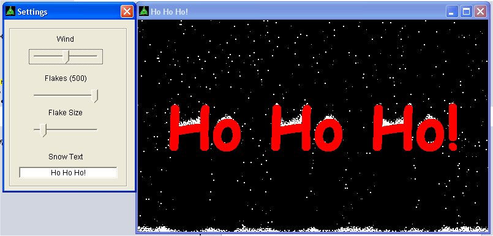

<div align="center">

## Snow is falling\.


</div>

### Description

There are a few of these on PSC, but none that allow you to change the size of the flakes or a lot of other things also.

I have commented this code A LOT :)

So it should help newbies and some oldies alike!
 
### More Info
 


<span>             |<span>
---                |---
**Submitted On**   |2004-11-24 08:59:06
**By**             |[cokey](https://github.com/Planet-Source-Code/PSCIndex/blob/master/ByAuthor/cokey.md)
**Level**          |Intermediate
**User Rating**    |5.0 (80 globes from 16 users)
**Compatibility**  |VB 6\.0
**Category**       |[Graphics](https://github.com/Planet-Source-Code/PSCIndex/blob/master/ByCategory/graphics__1-46.md)
**World**          |[Visual Basic](https://github.com/Planet-Source-Code/PSCIndex/blob/master/ByWorld/visual-basic.md)
**Archive File**   |[Snow\_is\_fa18215011242004\.zip](https://github.com/Planet-Source-Code/cokey-snow-is-falling__1-57402/archive/master.zip)

### API Declarations

```
Declare Function GetPixel Lib "gdi32" (ByVal hdc As Long, ByVal X As Long, ByVal Y As Long) As Long
Declare Function SetPixel Lib "gdi32" (ByVal hdc As Long, ByVal X As Long, ByVal Y As Long, ByVal crColor As Long) As Long
```


